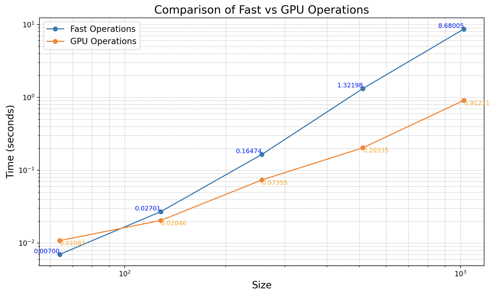

# MiniTorch Module 3


* Docs: https://minitorch.github.io/

* Overview: https://minitorch.github.io/module3.html


You will need to modify `tensor_functions.py` slightly in this assignment.

* Tests:

```
python run_tests.py
```

* Note:

Several of the tests for this assignment will only run if you are on a GPU machine and will not
run on github's test infrastructure. Please follow the instructions to setup up a colab machine
to run these tests.

This assignment requires the following files from the previous assignments. You can get these by running

```bash
python sync_previous_module.py previous-module-dir current-module-dir
```

The files that will be synced are:

        minitorch/tensor_data.py minitorch/tensor_functions.py minitorch/tensor_ops.py minitorch/operators.py minitorch/scalar.py minitorch/scalar_functions.py minitorch/module.py minitorch/autodiff.py minitorch/module.py project/run_manual.py project/run_scalar.py project/run_tensor.py minitorch/operators.py minitorch/module.py minitorch/autodiff.py minitorch/tensor.py minitorch/datasets.py minitorch/testing.py minitorch/optim.py


Task 3.1 and 3.2, output from:
python project/parallel_check.py 

(.venv) marquiswong@whale mod3-marquisywong % python project/parallel_check.py
MAP
 
================================================================================
 Parallel Accelerator Optimizing:  Function tensor_map.<locals>._map, 
/Users/marquiswong/workspace/mod3-marquisywong/minitorch/fast_ops.py (163)  
================================================================================


Parallel loop listing for  Function tensor_map.<locals>._map, /Users/marquiswong/workspace/mod3-marquisywong/minitorch/fast_ops.py (163) 
-----------------------------------------------------------------------------|loop #ID
    def _map(                                                                | 
        out: Storage,                                                        | 
        out_shape: Shape,                                                    | 
        out_strides: Strides,                                                | 
        in_storage: Storage,                                                 | 
        in_shape: Shape,                                                     | 
        in_strides: Strides,                                                 | 
    ) -> None:                                                               | 
        if np.array_equal(in_strides, out_strides) and np.array_equal(       | 
            in_shape, out_shape                                              | 
        ):                                                                   | 
            for x in prange(-------------------------------------------------| #0
                len(out)                                                     | 
            ):  #parallel loop                                               | 
                out[x] = fn(                                                 | 
                    in_storage[x]                                            | 
                )  #fn to input elem                                         | 
                                                                             | 
        else:                                                                | 
            for x in prange(-------------------------------------------------| #1
                len(out)                                                     | 
            ):  #parallel loop                                               | 
                out_index: Index = np.empty(MAX_DIMS, dtype=np.int32)        | 
                in_index: Index = np.empty(MAX_DIMS, dtype=np.int32)         | 
                                                                             | 
                #multi-dim index                                             | 
                to_index(x, out_shape, out_index)                            | 
                                                                             | 
                #corresponding input index                                   | 
                broadcast_index(out_index, out_shape, in_shape, in_index)    | 
                o = index_to_position(out_index, out_strides)  #output       | 
                i = index_to_position(in_index, in_strides)  #input          | 
                                                                             | 
                out[o] = fn(in_storage[i])                                   | 
--------------------------------- Fusing loops ---------------------------------
Attempting fusion of parallel loops (combines loops with similar properties)...
Following the attempted fusion of parallel for-loops there are 2 parallel for-
loop(s) (originating from loops labelled: #0, #1).
--------------------------------------------------------------------------------
----------------------------- Before Optimisation ------------------------------
--------------------------------------------------------------------------------
------------------------------ After Optimisation ------------------------------
Parallel structure is already optimal.
--------------------------------------------------------------------------------
--------------------------------------------------------------------------------
 
---------------------------Loop invariant code motion---------------------------
Allocation hoisting:
The memory allocation derived from the instruction at 
/Users/marquiswong/workspace/mod3-marquisywong/minitorch/fast_ops.py (185) is 
hoisted out of the parallel loop labelled #1 (it will be performed before the 
loop is executed and reused inside the loop):
   Allocation:: out_index: Index = np.empty(MAX_DIMS, dtype=np.int32)
    - numpy.empty() is used for the allocation.
The memory allocation derived from the instruction at 
/Users/marquiswong/workspace/mod3-marquisywong/minitorch/fast_ops.py (186) is 
hoisted out of the parallel loop labelled #1 (it will be performed before the 
loop is executed and reused inside the loop):
   Allocation:: in_index: Index = np.empty(MAX_DIMS, dtype=np.int32)
    - numpy.empty() is used for the allocation.
None
ZIP
 
================================================================================
 Parallel Accelerator Optimizing:  Function tensor_zip.<locals>._zip, 
/Users/marquiswong/workspace/mod3-marquisywong/minitorch/fast_ops.py (225)  
================================================================================


Parallel loop listing for  Function tensor_zip.<locals>._zip, /Users/marquiswong/workspace/mod3-marquisywong/minitorch/fast_ops.py (225) 
---------------------------------------------------------------------------|loop #ID
    def _zip(                                                              | 
        out: Storage,                                                      | 
        out_shape: Shape,                                                  | 
        out_strides: Strides,                                              | 
        a_storage: Storage,                                                | 
        a_shape: Shape,                                                    | 
        a_strides: Strides,                                                | 
        b_storage: Storage,                                                | 
        b_shape: Shape,                                                    | 
        b_strides: Strides,                                                | 
    ) -> None:                                                             | 
        if (                                                               | 
            np.array_equal(a_strides, b_strides)                           | 
            and np.array_equal(a_strides, out_strides)                     | 
            and np.array_equal(a_shape, b_shape)                           | 
            and np.array_equal(a_shape, out_shape)                         | 
        ):                                                                 | 
            for i in prange(len(out)):  #parallel loop---------------------| #2
                out[i] = fn(a_storage[i], b_storage[i])                    | 
        else:                                                              | 
            for i in prange(len(out)):  #parallel loop---------------------| #3
                                                                           | 
                out_index: Index = np.empty(MAX_DIMS, dtype=np.int32)      | 
                a_index: Index = np.empty(MAX_DIMS, dtype=np.int32)        | 
                b_index: Index = np.empty(MAX_DIMS, dtype=np.int32)        | 
                                                                           | 
                #multi-dim index, handle corresponding indices             | 
                to_index(i, out_shape, out_index)                          | 
                broadcast_index(out_index, out_shape, a_shape, a_index)    | 
                broadcast_index(out_index, out_shape, b_shape, b_index)    | 
                                                                           | 
                                                                           | 
                #flat storage positions                                    | 
                o = index_to_position(out_index, out_strides)              | 
                a = index_to_position(a_index, a_strides)                  | 
                b = index_to_position(b_index, b_strides)                  | 
                                                                           | 
                                                                           | 
                out[o] = fn(a_storage[a], b_storage[b])                    | 
--------------------------------- Fusing loops ---------------------------------
Attempting fusion of parallel loops (combines loops with similar properties)...
Following the attempted fusion of parallel for-loops there are 2 parallel for-
loop(s) (originating from loops labelled: #2, #3).
--------------------------------------------------------------------------------
----------------------------- Before Optimisation ------------------------------
--------------------------------------------------------------------------------
------------------------------ After Optimisation ------------------------------
Parallel structure is already optimal.
--------------------------------------------------------------------------------
--------------------------------------------------------------------------------
 
---------------------------Loop invariant code motion---------------------------
Allocation hoisting:
The memory allocation derived from the instruction at 
/Users/marquiswong/workspace/mod3-marquisywong/minitorch/fast_ops.py (247) is 
hoisted out of the parallel loop labelled #3 (it will be performed before the 
loop is executed and reused inside the loop):
   Allocation:: out_index: Index = np.empty(MAX_DIMS, dtype=np.int32)
    - numpy.empty() is used for the allocation.
The memory allocation derived from the instruction at 
/Users/marquiswong/workspace/mod3-marquisywong/minitorch/fast_ops.py (248) is 
hoisted out of the parallel loop labelled #3 (it will be performed before the 
loop is executed and reused inside the loop):
   Allocation:: a_index: Index = np.empty(MAX_DIMS, dtype=np.int32)
    - numpy.empty() is used for the allocation.
The memory allocation derived from the instruction at 
/Users/marquiswong/workspace/mod3-marquisywong/minitorch/fast_ops.py (249) is 
hoisted out of the parallel loop labelled #3 (it will be performed before the 
loop is executed and reused inside the loop):
   Allocation:: b_index: Index = np.empty(MAX_DIMS, dtype=np.int32)
    - numpy.empty() is used for the allocation.
None
REDUCE
 
================================================================================
 Parallel Accelerator Optimizing:  Function tensor_reduce.<locals>._reduce, 
/Users/marquiswong/workspace/mod3-marquisywong/minitorch/fast_ops.py (289)  
================================================================================


Parallel loop listing for  Function tensor_reduce.<locals>._reduce, /Users/marquiswong/workspace/mod3-marquisywong/minitorch/fast_ops.py (289) 
---------------------------------------------------------------------|loop #ID
    def _reduce(                                                     | 
        out: Storage,                                                | 
        out_shape: Shape,                                            | 
        out_strides: Strides,                                        | 
        a_storage: Storage,                                          | 
        a_shape: Shape,                                              | 
        a_strides: Strides,                                          | 
        reduce_dim: int,                                             | 
    ) -> None:                                                       | 
        for x in prange(len(out)):-----------------------------------| #4
            out_index: Index = np.empty(MAX_DIMS, dtype=np.int32)    | 
            #multi-dim index                                         | 
            to_index(x, out_shape, out_index)                        | 
            o = index_to_position(out_index, out_strides) #output    | 
            i = index_to_position(out_index, a_strides) #input       | 
                                                                     | 
            #accumulator using output tensor                         | 
            acc = out[o]                                             | 
                                                                     | 
            #handle strides for reduction                            | 
            step = a_strides[reduce_dim]                             | 
            for _ in range(a_shape[reduce_dim]):                     | 
                acc = fn(acc, a_storage[i])                          | 
                i += step                                            | 
                                                                     | 
            out[o] = acc                                             | 
--------------------------------- Fusing loops ---------------------------------
Attempting fusion of parallel loops (combines loops with similar properties)...
Following the attempted fusion of parallel for-loops there are 1 parallel for-
loop(s) (originating from loops labelled: #4).
--------------------------------------------------------------------------------
----------------------------- Before Optimisation ------------------------------
--------------------------------------------------------------------------------
------------------------------ After Optimisation ------------------------------
Parallel structure is already optimal.
--------------------------------------------------------------------------------
--------------------------------------------------------------------------------
 
---------------------------Loop invariant code motion---------------------------
Allocation hoisting:
The memory allocation derived from the instruction at 
/Users/marquiswong/workspace/mod3-marquisywong/minitorch/fast_ops.py (299) is 
hoisted out of the parallel loop labelled #4 (it will be performed before the 
loop is executed and reused inside the loop):
   Allocation:: out_index: Index = np.empty(MAX_DIMS, dtype=np.int32)
    - numpy.empty() is used for the allocation.
None
MATRIX MULTIPLY
 
================================================================================
 Parallel Accelerator Optimizing:  Function _tensor_matrix_multiply, 
/Users/marquiswong/workspace/mod3-marquisywong/minitorch/fast_ops.py (320)  
================================================================================


Parallel loop listing for  Function _tensor_matrix_multiply, /Users/marquiswong/workspace/mod3-marquisywong/minitorch/fast_ops.py (320) 
------------------------------------------------------------------------------------------------|loop #ID
def _tensor_matrix_multiply(                                                                    | 
    out: Storage,                                                                               | 
    out_shape: Shape,                                                                           | 
    out_strides: Strides,                                                                       | 
    a_storage: Storage,                                                                         | 
    a_shape: Shape,                                                                             | 
    a_strides: Strides,                                                                         | 
    b_storage: Storage,                                                                         | 
    b_shape: Shape,                                                                             | 
    b_strides: Strides,                                                                         | 
) -> None:                                                                                      | 
    """NUMBA tensor matrix multiply function.                                                   | 
                                                                                                | 
    Should work for any tensor shapes that broadcast as long as                                 | 
                                                                                                | 
    ```                                                                                         | 
    assert a_shape[-1] == b_shape[-2]                                                           | 
    ```                                                                                         | 
                                                                                                | 
    Optimizations:                                                                              | 
                                                                                                | 
    * Outer loop in parallel                                                                    | 
    * No index buffers or function calls                                                        | 
    * Inner loop should have no global writes, 1 multiply.                                      | 
                                                                                                | 
                                                                                                | 
    Args:                                                                                       | 
    ----                                                                                        | 
        out (Storage): storage for `out` tensor                                                 | 
        out_shape (Shape): shape for `out` tensor                                               | 
        out_strides (Strides): strides for `out` tensor                                         | 
        a_storage (Storage): storage for `a` tensor                                             | 
        a_shape (Shape): shape for `a` tensor                                                   | 
        a_strides (Strides): strides for `a` tensor                                             | 
        b_storage (Storage): storage for `b` tensor                                             | 
        b_shape (Shape): shape for `b` tensor                                                   | 
        b_strides (Strides): strides for `b` tensor                                             | 
                                                                                                | 
    Returns:                                                                                    | 
    -------                                                                                     | 
        None : Fills in `out`                                                                   | 
                                                                                                | 
    """                                                                                         | 
    a_batch_stride = a_strides[0] if a_shape[0] > 1 else 0                                      | 
    b_batch_stride = b_strides[0] if b_shape[0] > 1 else 0                                      | 
                                                                                                | 
    assert a_shape[-1] == b_shape[-2]                                                           | 
                                                                                                | 
                                                                                                | 
    for batch in prange(out_shape[0]):----------------------------------------------------------| #5
        #rows and cols                                                                          | 
        for cols in range(out_shape[-1]):  #column                                              | 
            for rows in range(out_shape[-2]):  #row                                             | 
                                                                                                | 
                #starting positions                                                             | 
                a_pos = batch * a_batch_stride + rows * a_strides[-2]                           | 
                b_pos = batch * b_batch_stride + cols * b_strides[-1]                           | 
                                                                                                | 
                acc = 0.0                                                                       | 
                                                                                                | 
                #reduction loop                                                                 | 
                for _ in range(a_shape[-1]):                                                    | 
                    acc += (                                                                    | 
                        a_storage[a_pos] * b_storage[b_pos]                                     | 
                    )  #accum dot prod                                                          | 
                    a_pos += a_strides[-1]                                                      | 
                    b_pos += b_strides[-2]                                                      | 
                                                                                                | 
                #pos in output tensor                                                           | 
                o = rows * out_strides[-2] + cols * out_strides[-1] + batch * out_strides[0]    | 
                #store                                                                          | 
                out[o] = acc                                                                    | 
--------------------------------- Fusing loops ---------------------------------
Attempting fusion of parallel loops (combines loops with similar properties)...
Following the attempted fusion of parallel for-loops there are 1 parallel for-
loop(s) (originating from loops labelled: #5).
--------------------------------------------------------------------------------
----------------------------- Before Optimisation ------------------------------
--------------------------------------------------------------------------------
------------------------------ After Optimisation ------------------------------
Parallel structure is already optimal.
--------------------------------------------------------------------------------
--------------------------------------------------------------------------------
 
---------------------------Loop invariant code motion---------------------------
Allocation hoisting:
No allocation hoisting found
None


Task 3.4:



/usr/local/lib/python3.12/dist-packages/numba/cuda/dispatcher.py:536: NumbaPerformanceWarning: Grid size 2 will likely result in GPU under-utilization due to low occupancy.
  warn(NumbaPerformanceWarning(msg))
/usr/local/lib/python3.12/dist-packages/numba/cuda/cudadrv/devicearray.py:888: NumbaPerformanceWarning: Host array used in CUDA kernel will incur copy overhead to/from device.
  warn(NumbaPerformanceWarning(msg))
Running size 64
/usr/local/lib/python3.12/dist-packages/numba/cuda/dispatcher.py:536: NumbaPerformanceWarning: Grid size 8 will likely result in GPU under-utilization due to low occupancy.
  warn(NumbaPerformanceWarning(msg))
{'fast': np.float64(0.007002830505371094), 'gpu': np.float64(0.010834217071533203)}
Running size 128
/usr/local/lib/python3.12/dist-packages/numba/cuda/dispatcher.py:536: NumbaPerformanceWarning: Grid size 32 will likely result in GPU under-utilization due to low occupancy.
  warn(NumbaPerformanceWarning(msg))
{'fast': np.float64(0.027009010314941406), 'gpu': np.float64(0.020455201466878254)}
Running size 256
{'fast': np.float64(0.164735476175944), 'gpu': np.float64(0.07354847590128581)}
Running size 512
{'fast': np.float64(1.3219787279764812), 'gpu': np.float64(0.20335078239440918)}
Running size 1024
{'fast': np.float64(8.680046240488688), 'gpu': np.float64(0.912109375)}

Timing summary
Size: 64
    fast: 0.00700
    gpu: 0.01083
Size: 128
    fast: 0.02701
    gpu: 0.02046
Size: 256
    fast: 0.16474
    gpu: 0.07355
Size: 512
    fast: 1.32198
    gpu: 0.20335
Size: 1024
    fast: 8.68005
    gpu: 0.91211


Task 3.5:
cpu: split; 100 hidden
!cd $DIR; PYTHONPATH=/content/$DIR python3.12 project/run_fast_tensor.py --BACKEND gpu --HIDDEN 100 --DATASET split --RATE 0.05
Epoch  0  loss  7.408746305731972 correct 34
Epoch  10  loss  6.542310938846727 correct 37
Epoch  20  loss  6.331750848814915 correct 38
Epoch  30  loss  4.6840015584880295 correct 47
Epoch  40  loss  3.458674111525527 correct 49
Epoch  50  loss  2.596898476763809 correct 47
Epoch  60  loss  1.6240851025920215 correct 50
Epoch  70  loss  2.0735923308969184 correct 48
Epoch  80  loss  2.505347902863944 correct 47
Epoch  90  loss  2.176232375431404 correct 49
Epoch  100  loss  1.5389852325494915 correct 50
Epoch  110  loss  1.1480553440087584 correct 50
Epoch  120  loss  1.148102303594253 correct 50
Epoch  130  loss  1.2578442069582354 correct 50
Epoch  140  loss  0.6353540039521243 correct 50
Epoch  150  loss  0.6525068645587497 correct 50
Epoch  160  loss  0.8211660363224462 correct 50
Epoch  170  loss  1.1269109800096568 correct 50
Epoch  180  loss  0.6858335218040819 correct 50
Epoch  190  loss  0.6579503219969504 correct 50
Epoch  200  loss  0.9582476161209506 correct 50
Epoch  210  loss  1.354049220244546 correct 50
Epoch  220  loss  0.6007186122073068 correct 50
Epoch  230  loss  0.25431896377524404 correct 50
Epoch  240  loss  0.9611838902039924 correct 50
Epoch  250  loss  0.18869036467383066 correct 50
Epoch  260  loss  0.33927404923233756 correct 50
Epoch  270  loss  0.23969755779208288 correct 50
Epoch  280  loss  0.36639680205441244 correct 50
Epoch  290  loss  0.3176659720895903 correct 50
Epoch  300  loss  0.9625869570858341 correct 50
Epoch  310  loss  0.27258172594809227 correct 50
Epoch  320  loss  0.17868709686353795 correct 50
Epoch  330  loss  0.5258015357472514 correct 50
Epoch  340  loss  0.3645374463513159 correct 50
Epoch  350  loss  0.5424464333702259 correct 50
Epoch  360  loss  0.3870120052317154 correct 50
Epoch  370  loss  0.12434828231814608 correct 50
Epoch  380  loss  0.09646080919532389 correct 50
Epoch  390  loss  0.31827742875302945 correct 50
Epoch  400  loss  0.35831273474724035 correct 50
Epoch  410  loss  0.4194278177996193 correct 50
Epoch  420  loss  0.27583187489361016 correct 50
Epoch  430  loss  0.2849496092259869 correct 50
Epoch  440  loss  0.21596763351525466 correct 50
Epoch  450  loss  0.13641009845763635 correct 50
Epoch  460  loss  0.03978600251068397 correct 50
Epoch  470  loss  0.11813606787525237 correct 50
Epoch  480  loss  0.04203354708536347 correct 50
Epoch  490  loss  0.12871811993798657 correct 50

Average Time Per Epoch: 1.454


cpu: split; 100 hidden
!cd $DIR; PYTHONPATH=/content/$DIR python3.12 project/run_fast_tensor.py --BACKEND cpu --HIDDEN 100 --DATASET split --RATE 0.05
Epoch  0  loss  7.030341114097229 correct 43
Epoch  10  loss  3.8733604963873134 correct 42
Epoch  20  loss  3.7510923123204734 correct 42
Epoch  30  loss  1.7506115890393628 correct 46
Epoch  40  loss  3.763661715102126 correct 49
Epoch  50  loss  2.502649639151011 correct 48
Epoch  60  loss  2.177933185554218 correct 45
Epoch  70  loss  1.1848088832851644 correct 49
Epoch  80  loss  1.5899123413927385 correct 50
Epoch  90  loss  1.3358007975677084 correct 48
Epoch  100  loss  2.5721477759705973 correct 44
Epoch  110  loss  0.7660238623551531 correct 50
Epoch  120  loss  1.3327501386936897 correct 50
Epoch  130  loss  0.1533351398466395 correct 50
Epoch  140  loss  0.37383264633056595 correct 50
Epoch  150  loss  0.6373224101332918 correct 50
Epoch  160  loss  0.8442554865522334 correct 50
Epoch  170  loss  1.0160623202369248 correct 50
Epoch  180  loss  0.23581381520060846 correct 50
Epoch  190  loss  0.240649560359624 correct 48
Epoch  200  loss  0.8583810402309251 correct 50
Epoch  210  loss  0.43398884871847093 correct 50
Epoch  220  loss  0.10971663081903561 correct 50
Epoch  230  loss  0.5465988508421493 correct 50
Epoch  240  loss  0.1932372418834142 correct 50
Epoch  250  loss  0.13095246568241528 correct 50
Epoch  260  loss  0.6510801846734288 correct 50
Epoch  270  loss  0.09160565028286331 correct 50
Epoch  280  loss  0.19229516161479618 correct 50
Epoch  290  loss  0.08783936618294307 correct 50
Epoch  300  loss  0.08607910593453781 correct 50
Epoch  310  loss  0.0787395784671809 correct 50
Epoch  320  loss  0.34164268430806455 correct 50
Epoch  330  loss  0.13849229082202325 correct 50
Epoch  340  loss  0.08413624690410614 correct 50
Epoch  350  loss  0.514672945012981 correct 50
Epoch  360  loss  0.7810274524946491 correct 50
Epoch  370  loss  0.8607042713804156 correct 50
Epoch  380  loss  0.44323353383422076 correct 50
Epoch  390  loss  0.1173188033011377 correct 50
Epoch  400  loss  0.11632357985391194 correct 50
Epoch  410  loss  0.5114570105280325 correct 50
Epoch  420  loss  0.21750757454311193 correct 50
Epoch  430  loss  0.09018377920847558 correct 50
Epoch  440  loss  0.3468697018285473 correct 50
Epoch  450  loss  0.37775388818065486 correct 50
Epoch  460  loss  0.23813269457705388 correct 50
Epoch  470  loss  0.2784838793407547 correct 50
Epoch  480  loss  0.022651417907034888 correct 50
Epoch  490  loss  0.1109612866808629 correct 50

Average Time Per Epoch: 0.100


gpu: diagonal; 150 hidden
!cd $DIR; PYTHONPATH=/content/$DIR python3.12 project/run_fast_tensor.py --BACKEND gpu --HIDDEN 150 --DATASET diagonal --RATE 0.05
Epoch  0  loss  11.675313213190165 correct 23
Epoch  10  loss  1.5083251365590709 correct 48
Epoch  20  loss  1.9604737513193666 correct 50
Epoch  30  loss  1.2036889849893317 correct 50
Epoch  40  loss  0.4864182969615428 correct 50
Epoch  50  loss  0.44007326321441065 correct 50
Epoch  60  loss  1.2007082762694263 correct 48
Epoch  70  loss  0.5938474180002482 correct 48
Epoch  80  loss  0.8820938155251907 correct 50
Epoch  90  loss  0.161735602353817 correct 48
Epoch  100  loss  1.206092080634181 correct 50
Epoch  110  loss  0.03369542564973369 correct 50
Epoch  120  loss  0.8126785669466016 correct 50
Epoch  130  loss  0.6708038967734089 correct 48
Epoch  140  loss  0.09699746842629563 correct 50
Epoch  150  loss  0.3997320506130613 correct 50
Epoch  160  loss  0.21547267795149258 correct 50
Epoch  170  loss  0.44183035741642984 correct 48
Epoch  180  loss  0.20723128295312218 correct 50
Epoch  190  loss  0.03208177447570681 correct 50
Epoch  200  loss  0.49525136451942803 correct 50
Epoch  210  loss  0.02551214222364397 correct 50
Epoch  220  loss  0.18856330278858963 correct 50
Epoch  230  loss  1.3072485887543226 correct 47
Epoch  240  loss  0.26685488674774194 correct 50
Epoch  250  loss  0.6007422730105072 correct 50
Epoch  260  loss  0.38022444208090145 correct 50
Epoch  270  loss  0.49241734674819454 correct 50
Epoch  280  loss  0.30678942497792827 correct 50
Epoch  290  loss  0.22875237090323727 correct 50
Epoch  300  loss  0.06064529810252374 correct 50
Epoch  310  loss  0.1577279081539377 correct 50
Epoch  320  loss  0.3092628289434881 correct 50
Epoch  330  loss  0.47540287478891385 correct 50
Epoch  340  loss  0.09372552389399072 correct 50
Epoch  350  loss  0.020846956646868465 correct 50
Epoch  360  loss  0.2545649770078824 correct 50
Epoch  370  loss  0.24777137920871986 correct 50
Epoch  380  loss  0.4000533019004751 correct 50
Epoch  390  loss  0.10071118890276248 correct 50
Epoch  400  loss  0.005152373687117642 correct 50
Epoch  410  loss  0.01025587493932732 correct 50
Epoch  420  loss  0.2824692298351483 correct 50
Epoch  430  loss  0.11726755923102407 correct 50
Epoch  440  loss  0.002844598686478851 correct 50
Epoch  450  loss  0.06565275856885328 correct 50
Epoch  460  loss  0.0013044698494168077 correct 50
Epoch  470  loss  0.2552819933068876 correct 50
Epoch  480  loss  0.4182103901709965 correct 50
Epoch  490  loss  0.013699484284218386 correct 50

Average Time Per Epoch: 1.608


cpu: diagonal; 150 hidden
!cd $DIR; PYTHONPATH=/content/$DIR python3.12 project/run_fast_tensor.py --BACKEND cpu --HIDDEN 150 --DATASET diagonal --RATE 0.05
Epoch  0  loss  3.9131398389600327 correct 45
Epoch  10  loss  0.7345004473935204 correct 47
Epoch  20  loss  0.5716781292541522 correct 49
Epoch  30  loss  0.22390262039936465 correct 50
Epoch  40  loss  0.6500186789066512 correct 50
Epoch  50  loss  1.0722739436574111 correct 50
Epoch  60  loss  0.5385694444683032 correct 50
Epoch  70  loss  0.2380216081635842 correct 50
Epoch  80  loss  0.4092211631613686 correct 50
Epoch  90  loss  0.00926989274495566 correct 50
Epoch  100  loss  0.7236223713887037 correct 50
Epoch  110  loss  0.0914843504286925 correct 50
Epoch  120  loss  0.24769359969076524 correct 50
Epoch  130  loss  0.1267285415217854 correct 50
Epoch  140  loss  0.5273719077490285 correct 50
Epoch  150  loss  0.30686152904701774 correct 50
Epoch  160  loss  0.40005985630539387 correct 50
Epoch  170  loss  0.19109795109017058 correct 50
Epoch  180  loss  0.17026402113372624 correct 50
Epoch  190  loss  0.030059837689725206 correct 50
Epoch  200  loss  0.40599500066290306 correct 50
Epoch  210  loss  0.0017461875796310393 correct 50
Epoch  220  loss  0.09505027795487891 correct 50
Epoch  230  loss  0.04233132209993972 correct 50
Epoch  240  loss  0.04116608535568674 correct 50
Epoch  250  loss  0.06957068203301146 correct 50
Epoch  260  loss  0.07570821272363605 correct 50
Epoch  270  loss  0.04325519779805714 correct 50
Epoch  280  loss  0.06419245482843579 correct 50
Epoch  290  loss  0.02429710898350429 correct 50
Epoch  300  loss  0.3269890145341015 correct 50
Epoch  310  loss  0.015627508062645356 correct 50
Epoch  320  loss  0.24034330760379882 correct 50
Epoch  330  loss  0.20771207503404587 correct 50
Epoch  340  loss  0.007179282951270532 correct 50
Epoch  350  loss  0.004677405705720845 correct 50
Epoch  360  loss  0.20044627700296994 correct 50
Epoch  370  loss  0.0023015869759798377 correct 50
Epoch  380  loss  0.0944178163008631 correct 50
Epoch  390  loss  0.006295459651567225 correct 50
Epoch  400  loss  0.05951678641544571 correct 50
Epoch  410  loss  0.19108138645423975 correct 50
Epoch  420  loss  0.057992262311923594 correct 50
Epoch  430  loss  0.012241555267761045 correct 50
Epoch  440  loss  0.15529333520726585 correct 50
Epoch  450  loss  0.006936508882868706 correct 50
Epoch  460  loss  0.03355486509034757 correct 50
Epoch  470  loss  0.14544754996260378 correct 50
Epoch  480  loss  0.006339730919590238 correct 50
Epoch  490  loss  0.1443878935850416 correct 50

Average Time Per Epoch: 0.157


gpu: xor; 200 hidden
!cd $DIR; PYTHONPATH=/content/$DIR python3.12 project/run_fast_tensor.py --BACKEND gpu --HIDDEN 200 --DATASET xor --RATE 0.05
Epoch  0  loss  22.980776083934494 correct 22
Epoch  10  loss  11.471137006003 correct 22
Epoch  20  loss  2.6043711657742725 correct 46
Epoch  30  loss  2.850581124258852 correct 45
Epoch  40  loss  2.0926139622638336 correct 45
Epoch  50  loss  2.9303444790498436 correct 46
Epoch  60  loss  1.7088049648255514 correct 47
Epoch  70  loss  1.2184784515476963 correct 47
Epoch  80  loss  1.6541913325992572 correct 47
Epoch  90  loss  2.4946255657935663 correct 48
Epoch  100  loss  1.8780591831423668 correct 48
Epoch  110  loss  0.7293464149820157 correct 47
Epoch  120  loss  2.318067878997279 correct 44
Epoch  130  loss  0.9027178922253101 correct 48
Epoch  140  loss  0.6699353008128779 correct 48
Epoch  150  loss  1.633923865939492 correct 48
Epoch  160  loss  0.8823233535096212 correct 46
Epoch  170  loss  1.7082311475936165 correct 48
Epoch  180  loss  1.769128441115973 correct 48
Epoch  190  loss  0.7901066043818388 correct 48
Epoch  200  loss  1.9827041789541628 correct 49
Epoch  210  loss  0.9742777486370817 correct 48
Epoch  220  loss  1.2370496691102553 correct 49
Epoch  230  loss  0.2669711261507258 correct 50
Epoch  240  loss  0.8018400439527371 correct 49
Epoch  250  loss  0.6576526995405448 correct 49
Epoch  260  loss  0.12210664857291817 correct 48
Epoch  270  loss  0.8383396927789877 correct 49
Epoch  280  loss  0.6815156876828031 correct 48
Epoch  290  loss  0.8489834753720578 correct 49
Epoch  300  loss  0.2831575570155673 correct 49
Epoch  310  loss  0.4904211005986389 correct 49
Epoch  320  loss  0.9148920713603792 correct 49
Epoch  330  loss  0.7019825418440394 correct 49
Epoch  340  loss  0.7101105027841383 correct 49
Epoch  350  loss  0.1593701098215327 correct 50
Epoch  360  loss  2.40451361573152 correct 49
Epoch  370  loss  0.9695602998715693 correct 49
Epoch  380  loss  1.441095495765996 correct 49
Epoch  390  loss  0.41931017271307747 correct 49
Epoch  400  loss  0.6359598284956552 correct 49
Epoch  410  loss  1.756745789821872 correct 49
Epoch  420  loss  1.1708116563477982 correct 49
Epoch  430  loss  0.35208138166533937 correct 49
Epoch  440  loss  2.37598342274481 correct 46
Epoch  450  loss  1.1266021283908496 correct 49
Epoch  460  loss  1.5166716866176473 correct 49
Epoch  470  loss  0.06092074621648631 correct 49
Epoch  480  loss  0.07048145062676862 correct 49
Epoch  490  loss  0.814074228434314 correct 49

Average Time Per Epoch: 1.524


cpu: xor; 200 hidden
!cd $DIR; PYTHONPATH=/content/$DIR python3.12 project/run_fast_tensor.py --BACKEND cpu --HIDDEN 200 --DATASET xor --RATE 0.05
Epoch  0  loss  15.40232131608206 correct 29
Epoch  10  loss  2.857390845924415 correct 44
Epoch  20  loss  3.4600702651042523 correct 45
Epoch  30  loss  3.705398912709966 correct 45
Epoch  40  loss  3.4480731064748236 correct 48
Epoch  50  loss  1.1319532539766355 correct 45
Epoch  60  loss  0.43155281827562886 correct 47
Epoch  70  loss  0.7856231444744515 correct 47
Epoch  80  loss  1.6458121452354557 correct 48
Epoch  90  loss  0.8805049465106871 correct 49
Epoch  100  loss  1.3794555415680179 correct 48
Epoch  110  loss  1.4595721256061935 correct 48
Epoch  120  loss  0.9607144162400021 correct 49
Epoch  130  loss  0.7683000158861463 correct 50
Epoch  140  loss  0.3422463871027058 correct 48
Epoch  150  loss  1.525477764908429 correct 50
Epoch  160  loss  2.275169733893966 correct 48
Epoch  170  loss  0.49522638458925977 correct 50
Epoch  180  loss  0.204404445737988 correct 49
Epoch  190  loss  0.18838046455174332 correct 49
Epoch  200  loss  0.9588239789962985 correct 49
Epoch  210  loss  0.47852865605547085 correct 50
Epoch  220  loss  0.13145649553486596 correct 49
Epoch  230  loss  1.325577073525413 correct 49
Epoch  240  loss  0.7183504571346748 correct 50
Epoch  250  loss  0.35129120111252987 correct 50
Epoch  260  loss  1.3338590620795956 correct 49
Epoch  270  loss  0.23932505441226398 correct 50
Epoch  280  loss  1.114072776629423 correct 49
Epoch  290  loss  0.3995536070692747 correct 49
Epoch  300  loss  0.08849460981978477 correct 49
Epoch  310  loss  1.2461201621792006 correct 49
Epoch  320  loss  0.20530128226374897 correct 50
Epoch  330  loss  0.7871548488917104 correct 49
Epoch  340  loss  0.9125365138072811 correct 49
Epoch  350  loss  0.16693922834174307 correct 49
Epoch  360  loss  1.2306447751774758 correct 49
Epoch  370  loss  1.6303203007406193 correct 49
Epoch  380  loss  1.0437209476507066 correct 49
Epoch  390  loss  1.3101180496490195 correct 49
Epoch  400  loss  1.2735630100971853 correct 49
Epoch  410  loss  0.5315331073445603 correct 50
Epoch  420  loss  1.2516885344353252 correct 49
Epoch  430  loss  0.8847035735309721 correct 49
Epoch  440  loss  0.13108163839396755 correct 50
Epoch  450  loss  1.1984103030379865 correct 49
Epoch  460  loss  0.1369187785376769 correct 49
Epoch  470  loss  0.16929436289273211 correct 50
Epoch  480  loss  0.1474567770471806 correct 49
Epoch  490  loss  0.19504933500929267 correct 50

Average Time Per Epoch: 0.203